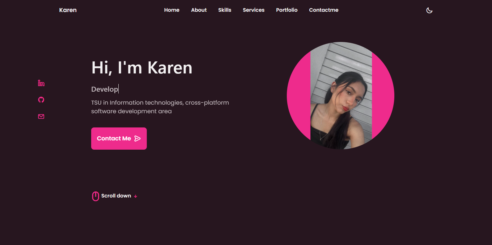
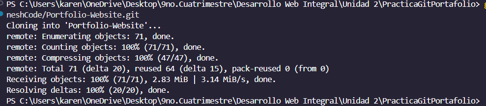
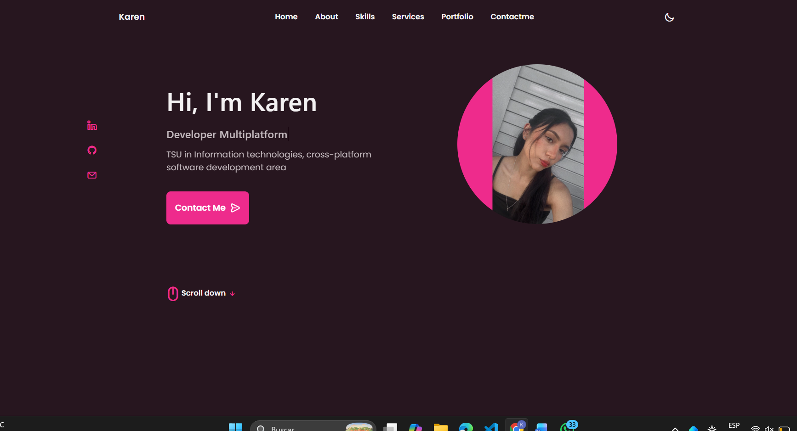
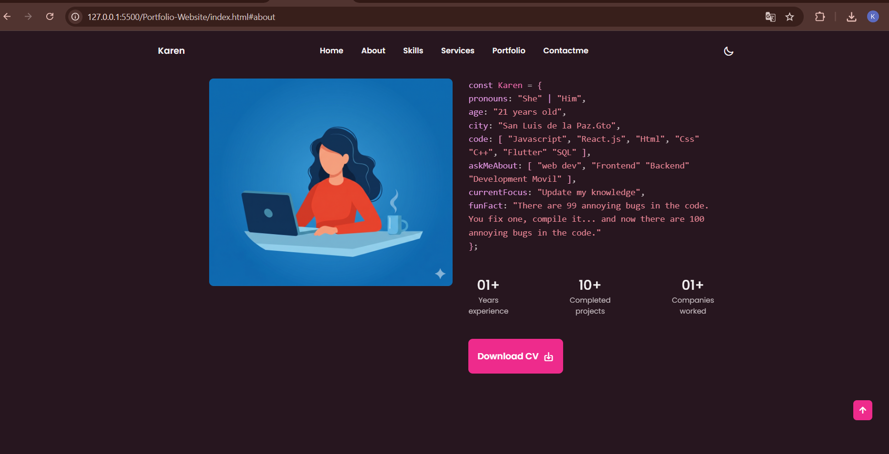
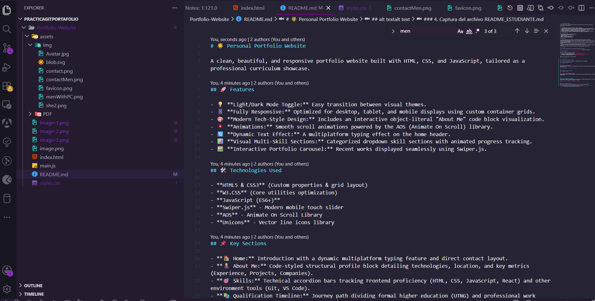
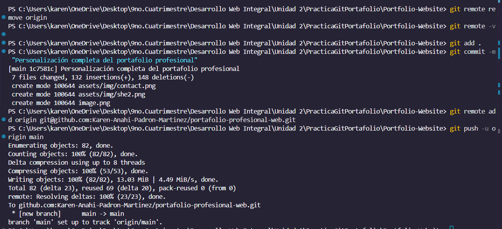

#  Personal Portfolio Website

A clean, beautiful, and responsive portfolio website built with HTML, CSS, and JavaScript, tailored as a professional curriculum showcase.

## Features

- 💡 **Light/Dark Mode Toggle:** Easy transition between visual themes.
- 📱 **Fully Responsive:** Optimized for desktop, tablet, and mobile displays using custom container grids.
- 🎨 **Modern Tech-Style Design:** Includes an interactive object-literal "About Me" code block visualization.
- 💥 **Animations:** Smooth scroll animations powered by the AOS (Animate On Scroll) library.
- 🔄 **Dynamic Text Effect:** A multiplatform typing effect on the home header.
- 📊 **Visual Multi-Skill Sections:** Categorized dropdown skill sections with animated progress tracking.
- 🖼️ **Interactive Portfolio Carousel:** Recent works displayed seamlessly using Swiper.js.

## 🛠️ Technologies Used

- **HTML5 & CSS3** (Custom properties & grid layout)
- **W3.CSS** (Core utilities optimization)
- **JavaScript (ES6+)**
- **Swiper.js** - Modern mobile touch slider
- **AOS** - Animate On Scroll Library
- **Unicons** - Vector line icons library

## 📌 Key Sections

- **🏠 Home:** Introduction with a dynamic multiplatform typing feature and direct contact layout.
- **👨‍💼 About Me:** Code-styled structural profile block detailing technologies, location, and key metrics (Experience, Projects, Companies).
- **🎯 Skills:** Technical accordion bars tracking Frontend proficiency (HTML, CSS, JavaScript, React) and other environment tools (Git, VS Code).
- **📚 Qualification Timeline:** Journey path dividing formal higher education (UTNG) and professional work history.
- **💼 Services:** Interactive modal pop-ups showcasing development capabilities.
- **🖼️ Portfolio Showcase:** Touch-controlled display showing recent live platforms (MarketingHub, Miga-Co, Core Bancario).
- **📧 Contact Me:** Ready-to-use input form bound with functional geographic and media links.

## 💻 Live Demo

You can view the live deployment of this portfolio by clicking the link below:

<a href="https://karenpadron.github.io/cv-website/" target="_blank">🔗 Open Karen's Portfolio</a>

## 📞 Contact & Networks

Feel free to connect or reach out for inquiries:

- **📧 Email:** [karenpadron0608@gmail.com](mailto:karenpadron0608@gmail.com)
- **💼 LinkedIn:** [linkedin.com/in/KarenPadron](https://www.linkedin.com/in/KarenPadron)
- **🐙 GitHub:** [github.com/KarenPadron](https://github.com/KarenPadron)

---
Made with ❤️ by Karen Padrón. All rights reserved.

## 📸 Evidencias de la Práctica / Entrega

Por favor, asegúrese de adjuntar las capturas correspondientes debajo de cada apartado:

### 1. Captura del repositorio clonado

---

### 2. Captura del sitio original

---

### 3. Captura del sitio personalizado

---

### 4. Captura del archivo README_ESTUDIANTE.md

---

### 5. Captura de comandos Git utilizados

---

### 6. URL del repositorio en GitHub

🔗 **Link del Repositorio:** https://github.com/Karen-Anahi-Padron-Martinez/portafolio-profesional-web  
